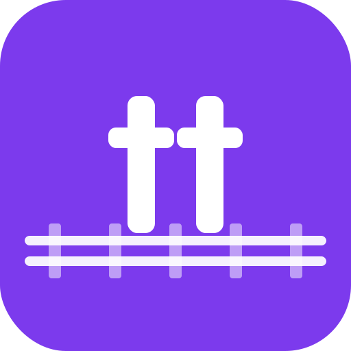

<p align="center">
  
</p>

# trick-track

A small personal PWA to track events — each has a timestamp, a category, and a note.
Data is stored locally on-device (IndexedDB) with JSON export/import for backup.

## How it was built

Vibecoded conversationally with **Claude Code** (Opus 4.8) — scoped in plan mode, then built and
refined iteratively. Claude Code pieces used along the way:

- **`frontend-design` plugin/skill** — shaped the visual identity (the logbook / departures-board
  look: signal-amber accent, monospace 24h times, the train-track logo).
- **Review subagents** — `harshy` for correctness reviews and a general-purpose agent for
  simplify/dedup passes, run after each batch of changes.
- **A dedicated test agent** that wrote and maintains the Playwright e2e suite, kept green as
  features evolved.
- **Playwright screenshots** as a visual feedback loop during the design passes.

Built on: Svelte 5 (runes) · Vite · TypeScript · Dexie (IndexedDB) · vite-plugin-pwa · es-toolkit ·
ESLint · Playwright · Bun.

## Develop

```sh
bun install
bun run dev      # local dev server
bun run check    # type-check
bun run build    # production build into dist/
bun run preview  # serve the production build
```
